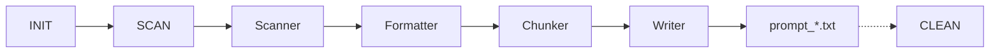

# Code Structure

The Snib pipeline manages the full project workflow: initializing a project, scanning directories to generate prompt-ready files, and cleaning up generated output.

_Content coming soon._